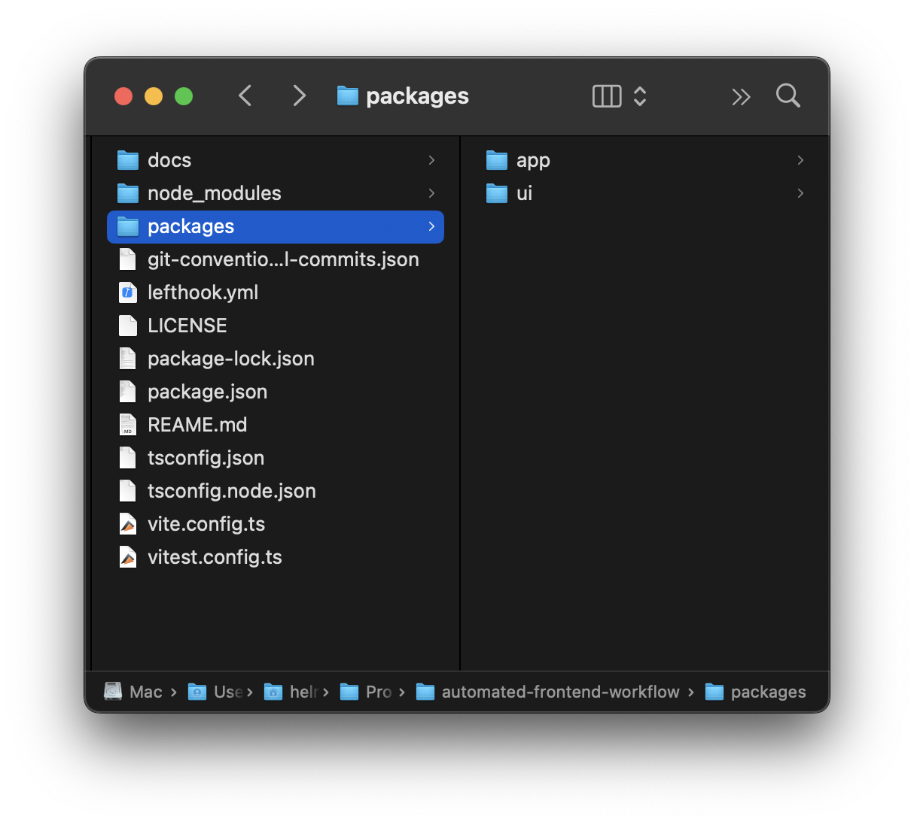
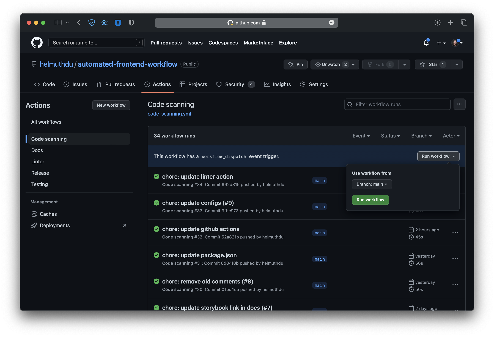
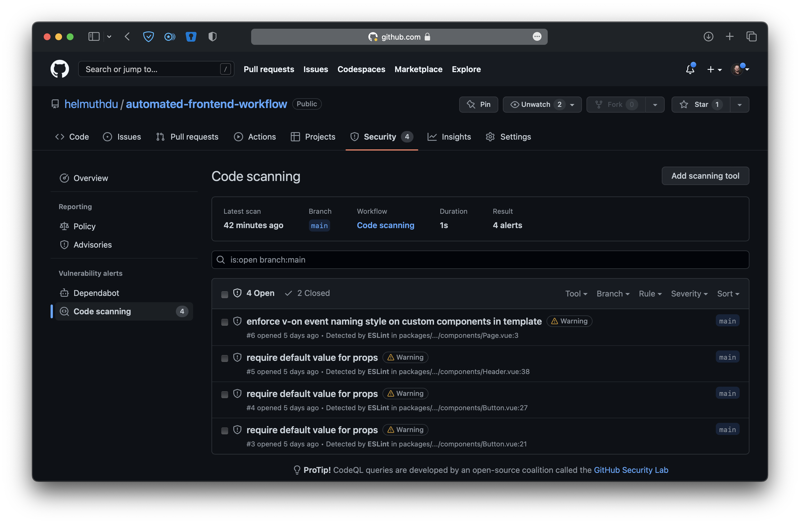
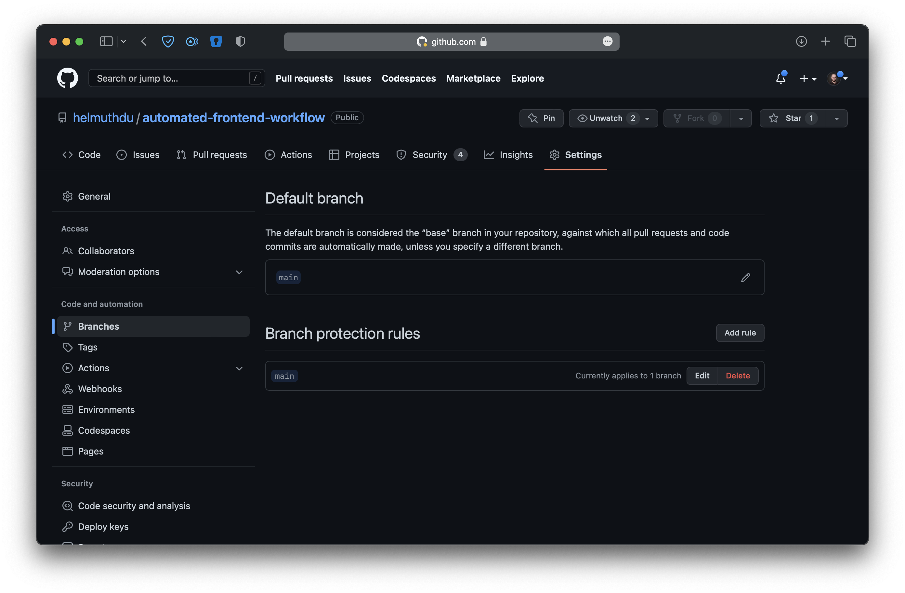
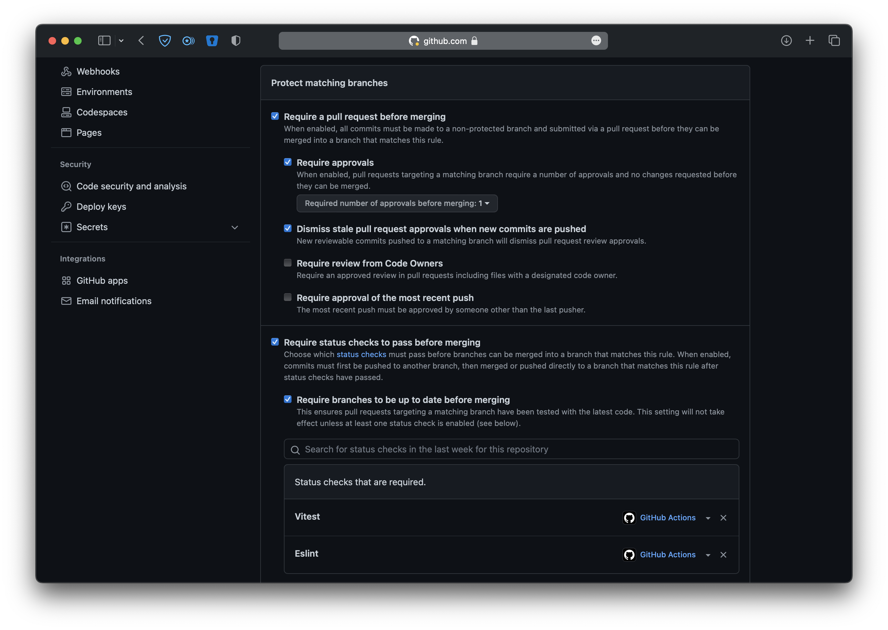
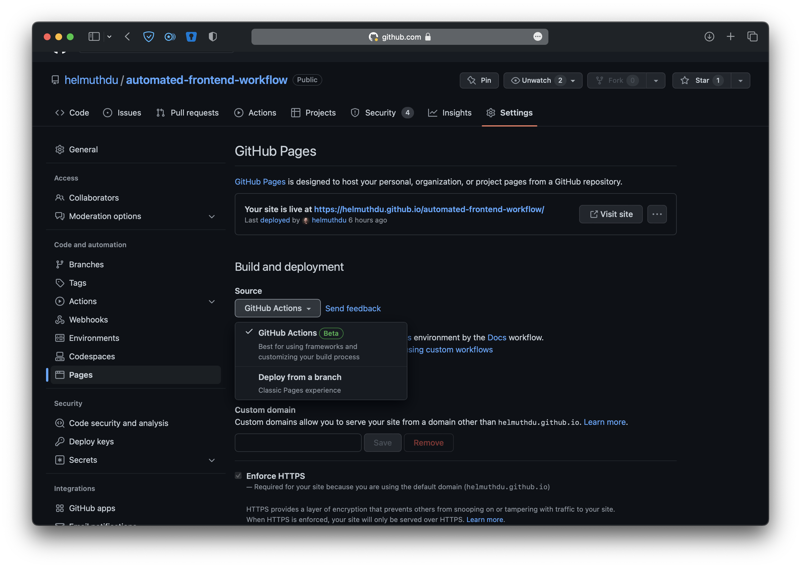

# Automated Modern Frontend Workflow

In a world where robots have not yet taken our place, we still have to deal with repetitive tasks. We are constantly trying to find the easiest and laziest way to accomplish something, some people call it efficiency. By letting the machine do the tedious part, it could give us more time to work or spend on interesting stuff.

In software development, there are also repetitive tasks that require manual intervention to complete the entire development phase. It's not just coding, there are other steps such as code/performance analysis, testing, build, and deployment, to name a few, and they can become a dull process, especially when you have to trigger or do them manually.

The tooling used as part of the front-end development process ensures everything is working or is done as expected. Besides the bundler, other common examples are [ESLint](http://eslint.org) (linter), [Prettier](http://prettier.io) (formatter), [Jest](https://jestjs.io) (testing), and [Cypress](https://www.cypress.io) (e2e).

> If you are interested in learning about these tools you can check my other article about [Testing in JavaScript](https://dev.to/helmuthdu/spaceships-and-testing-in-javascript-5b3h)

In this article, you will learn how to create, add and automate common front-end tools within your workflow.

## The Project

The goal is to build a modern mono-repo project using the following stack:

- [Vue](http://vuejs.org): An approachable, performant, and versatile framework for building web user interfaces.
- [Sass](https://sass-lang.com): CSS with superpowers.
- [TypeScript](https://www.typescriptlang.org/): A strongly typed programming language that builds on JavaScript.
- [Vite](https://vitejs.dev): Fast bundler to create web projects
- [Vitest](http://vitest.dev): A Vite-native fast unit test framework.
- [VitePress](https://vitepress.vuejs.org): Modern SSG framework built on top of Vite.
- [Storybook](http://storybook.js.org): Storybook is a front-end workshop for building UI components and pages in isolation.
- [Prettier](http://prettier.io): An opinionated code formatter.
- [ESLint](http://eslint.org): Statically analyzes your code to quickly find problems.
- [Stylelint](https://stylelint.io): A modern linter that helps you avoid errors and enforce conventions in your styles.
- [Changesets](https://github.com/changesets/changesets): A way to manage your versioning and changelogs with a focus on mono repo.



Most steps can be manually adjusted to your preferred JS library or framework, like React, Svelte or Angular. You can check the final result at the following link: [https://github.com/helmuthdu/automated-frontend-workflow](https://github.com/helmuthdu/automated-frontend-workflow)

### Setup

To start, open the terminal, create a new folder and initialize the project.

```shell
mkdir automated-frontend-workflow
cd automated-frontend-workflow
npm init
```

After completed. Open the newest created `package.json` file and add the [workspaces](https://docs.npmjs.com/cli/using-npm/workspaces) config to it:

```json
...
"workspaces": [
  "packages/*"
]
```

#### Prettier

Install [Prettier](http://prettier.io):

```shell
npm i -D prettier
```

Create a `.prettierrc` file.

```json
{
  "arrowParens": "avoid",
  "bracketSameLine": true,
  "bracketSpacing": true,
  "htmlWhitespaceSensitivity": "ignore",
  "printWidth": 120,
  "semi": true,
  "singleQuote": true,
  "tabWidth": 2,
  "trailingComma": "none",
  "useTabs": false,
  "vueIndentScriptAndStyle": false
}
```

#### Sass

Install [Sass](https://sass-lang.com):

```shell
npm i -D sass
```

#### TypeScript

Install [TypeScript](https://www.typescriptlang.org):

```shell
npm i -D typescript
```

Create a `tsconfig.json` file.

```json
{
  "compilerOptions": {
    "target": "ESNext",
    "useDefineForClassFields": true,
    "module": "ESNext",
    "moduleResolution": "Node",
    "strict": true,
    "jsx": "preserve",
    "resolveJsonModule": true,
    "isolatedModules": true,
    "esModuleInterop": true,
    "lib": ["ESNext", "DOM"],
    "skipLibCheck": true,
    "noEmit": true,
    "types": ["vitest/globals"]
  },
  "references": [{ "path": "./tsconfig.node.json" }],
  "ts-node": {
    "compilerOptions": {
      "module": "ESNext"
    }
  }
}
```

Create a `tsconfig.node.json` file.

```json
{
  "compilerOptions": {
    "composite": true,
    "module": "ESNext",
    "moduleResolution": "Node",
    "allowSyntheticDefaultImports": true
  },
  "include": ["vite.config.ts"]
}
```

#### Vite

Install [Vite](https://vitejs.dev):

```shell
npm i -D vite @vitejs/plugin-vue vue vue-tsc
```

Create a `vite.config.ts` file.

```typescript
import { defineConfig } from 'vite';
import vue from '@vitejs/plugin-vue';

// https://vitejs.dev/config/
export default defineConfig({
  plugins: [vue()]
});
```

#### Vitest

Install [Vitest](http://vitest.dev):

```shell
npm i -D vitest jsdom @vue/test-utils
```

Create a `vitest.config.ts` file.

```typescript
/// <reference types="vitest" />

import { defineConfig } from 'vite';
import Vue from '@vitejs/plugin-vue';

export default defineConfig({
  plugins: [Vue()],
  test: {
    globals: true,
    environment: 'jsdom'
  }
});
```

Update the `package.json` file by adding these new commands:

```json
"scripts": {
  ...
  "test": "vitest",
},
```

#### VitePress

Install [VitePress](https://vitepress.vuejs.org):

```shell
npm i -D vitepress
```

Create a `docs/.vitepress/config.ts` file.

```typescript
export default {
  title: 'Automated Frontend Workflow',
  description: 'Frontend Tooling made Easy',
  base: 'https://helmuthdu.github.io/automated-frontend-workflow/'
};
```

> The `base` property should reflect your git project.

Create a `docs/index.md` file.

```markdown
# Hello VitePress

[Go to Storybook](https://helmuthdu.github.io/automated-frontend-workflow/storybook)
```

Update the `package.json` file by adding these new commands:

```json
"scripts": {
  ...
  "docs:dev": "vitepress dev docs",
  "docs:build": "vitepress build docs",
  "docs:preview": "vitepress preview docs"
},
```

#### Storybook

Install [Storybook](http://storybook.js.org):

```shell
npx sb init --builder @storybook/builder-vite
```

Open the `.storybook/.main.js` file and configure it as follows.

```typescript
module.exports = {
  stories: ['../packages/**/*.stories.mdx', '../packages/**/*.stories.@(js|jsx|ts|tsx)'],
  addons: ['@storybook/addon-links', '@storybook/addon-essentials', '@storybook/addon-interactions'],
  framework: '@storybook/vue3',
  core: {
    builder: '@storybook/builder-vite'
  },
  features: {
    storyStoreV7: true
  },
  async viteFinal(config, options) {
    config.base = './';
    return config;
  },
  env: config => ({
    ...config,
    STORYBOOK_BASE_URL:
      process.env.NODE_ENV === 'production' ? 'https://helmuthdu.github.io/automated-frontend-workflow/storybook/' : ''
  })
};
```

> The `STORYBOOK_BASE_URL` property should reflect your git project.

Create a `.storybook/manager-head.html` file.

```html
<!-- .storybook/manager-head.html -->
<base href="%STORYBOOK_BASE_URL%" target="_blank" />
<meta name="description" content="Components for my awesome project" key="desc" />
```

#### ESLint

Install [ESLint](http://eslint.org):

```shell
npm i -D eslint @typescript-eslint/eslint-plugin @typescript-eslint/parser @microsoft/eslint-formatter-sarif eslint-config-prettier eslint-plugin-prettier eslint-plugin-vue vue-eslint-parser @vue/eslint-config-typescript
```

Create a `.eslintrc.cjs` file.

```javascript
module.exports = {
  root: true,
  env: {
    browser: true,
    es2021: true,
    node: true
  },
  parser: '@typescript-eslint/parser',
  parserOptions: {
    parser: '@typescript-eslint/parser',
    ecmaVersion: 2021
  },
  plugins: ['@typescript-eslint', 'prettier'],
  extends: [
    'eslint:recommended',
    'plugin:@typescript-eslint/recommended',
    'plugin:prettier/recommended',
    'plugin:storybook/recommended'
  ],
  rules: {
    'no-console': process.env.NODE_ENV === 'production' ? 'warn' : 'off',
    'no-debugger': process.env.NODE_ENV === 'production' ? 'warn' : 'off',
    '@typescript-eslint/interface-name-prefix': 'off',
    '@typescript-eslint/explicit-function-return-type': 'off',
    '@typescript-eslint/explicit-module-boundary-types': 'off',
    '@typescript-eslint/no-explicit-any': 'off',
    '@typescript-eslint/no-non-null-assertion': 'off',
    '@typescript-eslint/no-unused-vars': [
      'off',
      {
        argsIgnorePattern: '^_'
      }
    ],
    'prettier/prettier': 'error'
  },
  overrides: [
    {
      files: ['*.ts', '*.tsx'],
      rules: {
        // The core 'no-unused-vars' rules (in the eslint:recommeded ruleset)
        // does not work with type definitions
        'no-unused-vars': 'off'
      }
    },
    {
      files: ['**/__tests__/*.{j,t}s?(x)', 'packages/**/src/**/*.spec.{j,t}s?(x)'],
      env: {
        jest: true
      }
    },
    {
      files: ['packages/**/src/**/*.vue'],
      parser: 'vue-eslint-parser',
      parserOptions: {
        extraFileExtensions: ['.vue'],
        ecmaFeatures: {
          jsx: true
        },
        ecmaVersion: 2021
      },
      extends: ['plugin:vue/vue3-recommended', '@vue/typescript/recommended', 'plugin:prettier/recommended']
    }
  ]
};
```

Update the `package.json` file by adding these new commands:

```json
"scripts": {
  ...
  "lint": "npm run lint -ws",
  "lint:report": "eslint --ext .jsx,.js,.ts,.tsx,.vue --fix --format @microsoft/eslint-formatter-sarif --output-file eslint-results.sarif packages/**/src",
},
```

#### Stylelint

Install [Stylelint](https://stylelint.io):

```shell
npm i -D postcss postcss-html stylelint stylelint-config-prettier stylelint-config-recommended-vue stylelint-config-standard-scss
```

Create a `.stylelintrc` file.

```json
{
  "extends": ["stylelint-config-standard-scss", "stylelint-config-recommended-vue/scss", "stylelint-config-prettier"],
  "rules": {
    "selector-class-pattern": [
      "^.([a-z0-9-]+)?(__([a-z0-9]+-?)+)?(--([a-z0-9]+-?)+){0,2}$",
      { "resolveNestedSelectors": true }
    ]
  }
}
```

## GitHub

[GitHub](https://github.com), Inc. is an Internet hosting service for software development and version control using Git.

### GitHub Integration

Create a new repository in [GitHub](https://github.com), open the terminal inside the project, and configure it:

> Replace the `$GITHUB_USER` and the `$REPO_NAME` variables with your [GitHub](https://github.com) user and repository name.

```shell
git init
git add README.md
git commit -m "feat: project setup"
git branch -M main
git remote add origin https://github.com/$GITHUB_USER/$REPO_NAME.git
git push -u origin main
```

### Git hooks

Git has a way to fire off custom scripts when certain actions occur, such as `commit` and `push`. There is a [variety of hooks available](https://git-scm.com/docs/githooks), but you can start with these:

- `commit-msg`: Check the commit message format or spelling errors.
- `pre-commit`: Check for errors and enforce project coding standards.
- `pre-push`: Run tests to ensure working software

You can [create them manually](https://git-scm.com/book/en/v2/Customizing-Git-Git-Hooks), or use [Lefthook](https://github.com/evilmartians/lefthook) to simplify the process.

#### Lefthook

[Lefthook](https://github.com/evilmartians/lefthook) is a fast and powerful Git hooks manager for Node.js and any other type of project written in Go.

To install [Lefthook](https://github.com/evilmartians/lefthook), open the terminal in your project:

```shell
npm install -D lefthook
```

After installed, it will generate a `lefthook.yml` file which can be customized to perform a static code analysis before committing the code. For example, it can ensure that the git commit follows the [git-conventional-commits](https://github.com/qoomon/git-conventional-commits), and use [Prettier](http://prettier.io), [ESLint](http://eslint.org), and [Stylelint](https://stylelint.io) to check, format, and fix any file which will be committed and run any test related with [Vitest](http://vitest.dev) depending on the filetype and run each in parallel.

- For `.html`, `.json`, and `.yml` files, reformat with [Prettier](http://prettier.io)
- For `.css` and `.scss` files, check the styles with [Stylelint](https://stylelint.io) and [Prettier](http://prettier.io) after.
- For `.js` and `.ts` files, excluding tests, run [ESLint](http://eslint.org) and check related tests with [Vitest](http://vitest.dev) after.
- For `.spec.js` and `.spec.ts` tests files, run [ESLint](http://eslint.org), and the tests with [Vitest](http://vitest.dev) after.

To start, initialize the git-conventional-commits with `npx git-conventional-commits init` command, and then you update the `lefthook.yml` as follows:

```yaml
commit-msg:
  commands:
    validate:
      run: >
        npx git-conventional-commits commit-msg-hook {1}

pre-commit:
  parallel: true
  commands:
    lint:misc:
      glob: '*.{html,json,yml}'
      run: npx prettier --write {staged_files}
    lint:css:
      glob: '*.{css,scss}'
      run: >
        npx stylelint --fix {staged_files} &&
        npx prettier --write {staged_files}
    lint:js:
      glob: '*[!.{spec,test}].{[tj]s,[tj]sx}'
      run: >
        npx eslint --fix {staged_files} && 
        npx vitest related {staged_files} --passWithNoTests --run --environment jsdom
    test:unit:
      glob: '*.{spec,test}.{[tj]s,[tj]sx}'
      run: >
        npx eslint --fix {staged_files} &&
        npx vitest {staged_files} --run --environment jsdom
```

That's it, now every time you commit your code these commands will run automatically

## GitHub Actions

[GitHub Actions](https://docs.github.com/en/actions) is a continuous integration and continuous delivery (CI/CD) platform that allows you to automate your build, test, and deployment pipeline. You can create workflows that build and test every pull request to your repository, or deploy merged pull requests to production.

The [GitHub Actions](https://docs.github.com/en/actions) workflows are located in the `.github/workflows` folder and are composed of:

- `Workflow`: A workflow is a configurable-automated process that will run one or more jobs.
- `Events`: An event is a specific activity in a repository that triggers a workflow run.
- `Jobs`: A job is a set of steps in a workflow that executes on the same runner. Each step is either a shell script that will be executed or an action that will be run.
- `Runners`: A runner is a server that runs your workflows when they're triggered. Each runner can run a single job at a time.
- `Actions`: An action is a custom application for the [GitHub Actions](https://docs.github.com/en/actions) platform that performs a complex but frequently repeated task.

Do not worry, you will understand better those processes with the examples below showing common cases in a real-life project.

### Code Analysis

To ensure code quality, the code should be checked, validated, and reported.

1. Start by creating a new file in your GitHub repository called `.github/workflows/code-analysis.yml`. This file will define the workflow that your GitHub Action will follow.
2. In the `.github/workflows/code-analysis.yml` file, you can use the `on` keyword to specify when the workflow should be triggered. For example, you might want to trigger the workflow when a new code is pushed to the repository with the option to trigger it manually. You can do this by adding the following lines to the file:
   ```yaml
   on:
     push:
       branches:
         - 'main'
     workflow_dispatch:
   ```
3. You can set the `concurrency` property to run only one instance, so if it is running while a new commit is pushed it will be canceled and restarted.
   ```yaml
   concurrency: ${{ github.workflow }}-${{ github.ref }}
   ```
4. It might be required to set some permissions to read and write content. You can check all available permissions by [clicking here](https://docs.github.com/en/rest/actions/permissions).
   ```yaml
   permissions:
     # required for all workflows
     security-events: write
     # only required for workflows in private repositories
     actions: read
     contents: read
   ```
5. Actions can be cached to accelerate the process. For example, in the Node.js setup action, it is possible to cache the NPM packages, so it won't have to fetch everything every time the job is running.
   ```yaml
   - name: Setup Node.js
     uses: actions/setup-node@v3
     with:
       node-version: 16
       cache: 'npm'
   ```
6. To complete, in the job section, specify the steps that the GitHub Action should perform. For example, you might want to first check out the code from the repository, generate a code analysis report and upload it to GitHub:

   ```yaml
   # code-scanning.yml
   name: Code scanning

   on:
     push:
       branches:
         - 'main'
     workflow_dispatch:

   concurrency:
     group: ${{ github.workflow }}-${{ github.ref }}
     cancel-in-progress: true

   jobs:
     eslint:
       name: Eslint
       runs-on: ubuntu-latest
       permissions:
         # required for all workflows
         security-events: write
         # only required for workflows in private repositories
         actions: read
         contents: read
       steps:
         - name: Checkout Repository
           uses: actions/checkout@v3

         - name: Setup Node.js
           uses: actions/setup-node@v3
           with:
             node-version: 16
             cache: 'npm'

         - name: Install dependencies
           run: npm ci

         - name: Run linter
           run: npm run lint:report
           continue-on-error: true

         - name: Upload analysis results to GitHub
           uses: github/codeql-action/upload-sarif@v2
           with:
             sarif_file: eslint-results.sarif
             wait-for-processing: true
   ```

After creating the workflow, you can go to your [GitHub](https://github.com) repo and run it manually to check the results. You can trigger this action by clicking in the `Actions` Tab -> `Code scanning` Workflow -> `Run workflow` Dropdown -> `Run workflow` Button.



To see the result, go to the `Security` -> `Code scanning` session.



The missing part is that these checks should also run on any code which will be submitted through a PR in the project and block any change which does not follow the required rules.

#### Linters

Linters, in short, are tools to help you improve your code. It can be configured to run on every Pull Request (PR) to guarantee that any new code has the same standards defined.

1. Similar to the previous workflow, start by creating a new file in your GitHub repository called `.github/workflows/linter.yml`.
2. In the `on` keyword, set it to run on `pull_request`.
   ```yaml
   on: [pull_request]
   ```
3. Configure the `concurrency` to have only one workflow running at a time.
   ```yaml
   concurrency: ${{ github.workflow }}-${{ github.ref }}
   ```
4. Define the Runner. Usually, the `ubuntu-latest` runner is a safe choice.
   ```yaml
   jobs:
     eslint:
       runs-on: ubuntu-latest
   ```
5. Next, add all steps to perform a `checkout` action to fetch the code, do another action to `setup-node` with the `node-version` 16 with the `cache` enabled for all `npm` packages, install all dependencies with `npm ci` command and finally run the linters with `npm run linter` command

```yaml
# linter.yml
name: Linter

on: [pull_request]

concurrency:
  group: ${{ github.workflow }}-${{ github.ref }}
  cancel-in-progress: true

jobs:
  eslint:
    name: Eslint
    runs-on: ubuntu-latest
    steps:
      - name: Checkout Repository
        uses: actions/checkout@v3

      - name: Setup Node.js
        uses: actions/setup-node@v3
        with:
          node-version: 16
          cache: 'npm'

      - name: Install dependencies
        run: npm ci

      - name: Run linter
        run: npm run lint
```

#### Testing

It should run similarly to the Linters workflow, but executing the `npm run test` command instead.

```yaml
# testing.yml
name: Testing

on: [pull_request]

concurrency:
  group: ${{ github.workflow }}-${{ github.ref }}
  cancel-in-progress: true

jobs:
  vitest:
    name: Vitest
    runs-on: ubuntu-latest
    steps:
      - name: Checkout Repository
        uses: actions/checkout@v3

      - name: Setup Node.js
        uses: actions/setup-node@v3
        with:
          node-version: 16
          cache: 'npm'

      - name: Install dependencies
        run: npm ci

      - name: Run tests
        run: npm run test
```

### Branch Protection

Adding the workflows is just one step, you also need to configure your branch's rules. Open your repository in [GitHub](https://github.com) and go to `Settings` -> `Branches`.



Click in the `Add rule` button, insert the repo name your want this rule to be associated with at the beginning, and make sure the workflows are set as required in the `Require branches to be up to date before merging` option.



To complete, click on the `Create` button at bottom of the page.

### Docs

For the documentation, we have a scenario where there is VitePress and Storybook need to publish together. Before creating the workflow, enable the pages in the repo settings.



1. Similar to the previous workflow, start by creating a new file in your GitHub repository called `.github/workflows/docs.yml`.
2. In the `on` keyword, set it to run on `push` to the `main` branch, also add option to trigger it manually with `workflow_dispatch`.
   ```yaml
   on:
     # Runs on pushes targeting the default branch
     push:
       branches:
         - 'main'
     # Allows you to run this workflow manually from the Actions tab
     workflow_dispatch:
   ```
3. Configure the `concurrency` to have only one workflow running at a time.
   ```yaml
   concurrency: ${{ github.workflow }}-${{ github.ref }}
   ```
4. Define the Runner to the `ubuntu-latest`.
   ```yaml
   jobs:
     eslint:
       runs-on: ubuntu-latest
   ```
5. Add all actions to perform a `checkout` to fetch the code, do another action to `setup-node`, install all dependencies with the `npm ci` command, build storybook with the target to the public folder inside the docs, so when VitePress runs the `build` command it will copy the storybook files together and after everything is built trigger and action to setup GitHub Pages and update generated page artifact. 
6. To complete, add another job, grant the permissions to write, and call the deploy pages action.

```yaml
# docs.yml
name: Docs

on:
  # Runs on pushes targeting the default branch
  push:
    branches:
      - 'main'
  # Allows you to run this workflow manually from the Actions tab
  workflow_dispatch:

jobs:
  build:
    name: Build
    # Specify runner + deployment step
    runs-on: ubuntu-latest
    steps:
      - name: Checkout Repository
        uses: actions/checkout@v3

      - name: Setup Node.js
        uses: actions/setup-node@v3
        with:
          node-version: 16
          cache: 'npm'

      - name: Install dependencies
        run: npm ci

      - name: Build Storybook
        run: npm run storybook:build

      - name: Build VitePress
        run: npm run docs:build

      - name: Setup pages
        uses: actions/configure-pages@v2

      - name: Upload artifact
        uses: actions/upload-pages-artifact@v1
        with:
          path: 'docs/.vitepress/dist'

  # Deployment job
  deploy:
    name: Deploy
    # Add a dependency to the build job
    needs: build
    # Specify runner + deployment step
    runs-on: ubuntu-latest
    # Grant GITHUB_TOKEN the permissions required to make a Pages deployment
    permissions:
      pages: write # to deploy to Pages
      id-token: write # to verify the deployment originates from an appropriate source
    # Deploy to the github-pages environment
    environment:
      name: github-pages
      url: ${{ steps.deployment.outputs.page_url }}
    steps:
      - name: Deploy to GitHub Pages
        id: deployment
        uses: actions/deploy-pages@v1
```

## Conclusion

[GitHub Actions](https://docs.github.com/en/actions) are a powerful tool that can help you in your daily job, and you just hit the tip of the iceberg. To learn more, check the [official documentation](https://docs.github.com/en/actions) and take a look at some [starter workflows](https://github.com/actions/starter-workflows).
